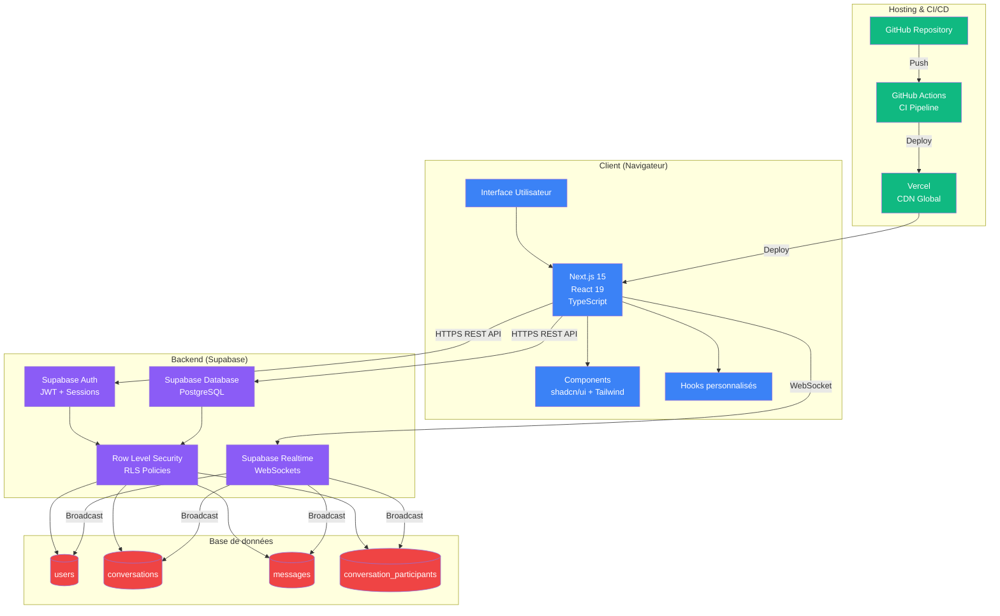
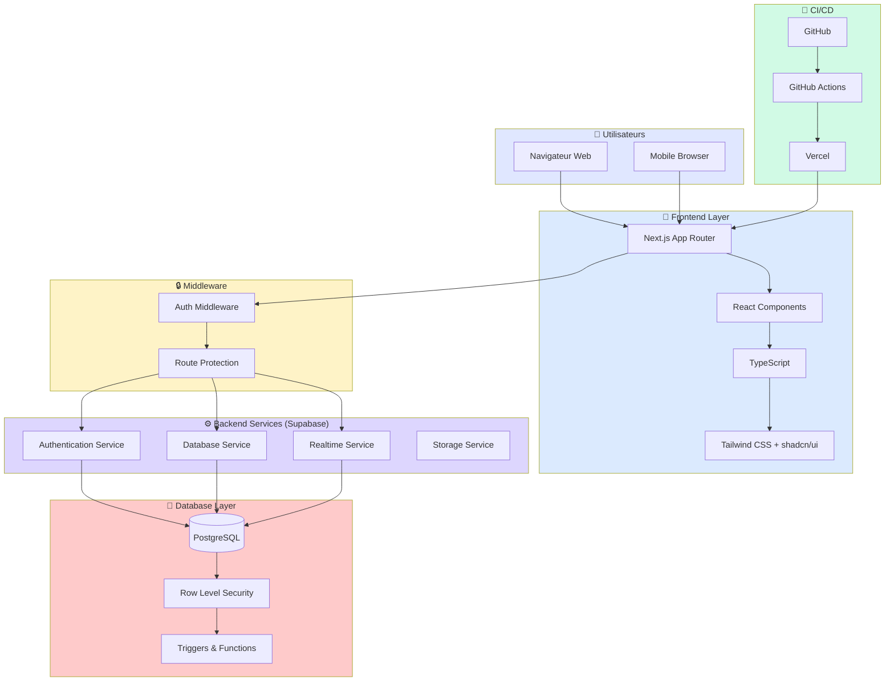
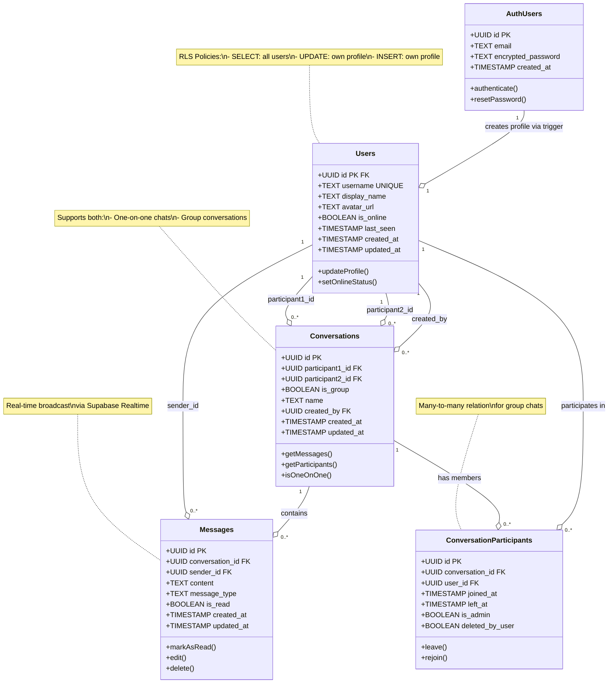
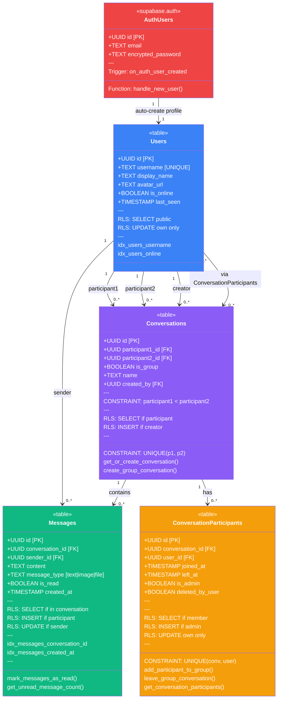
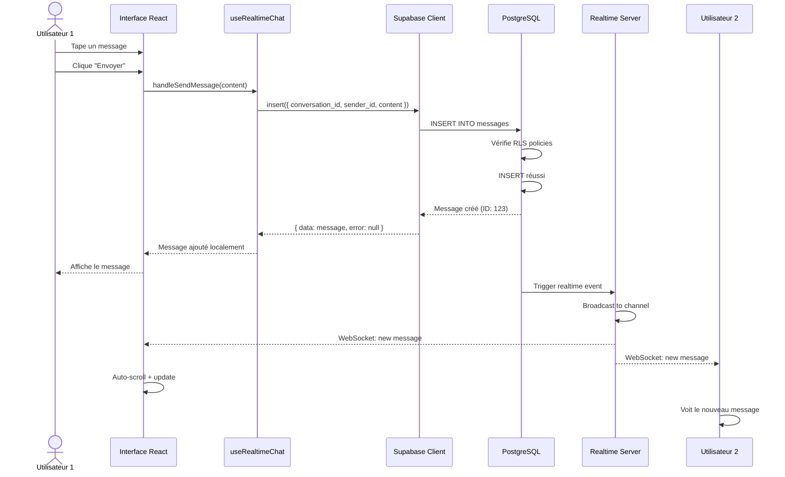
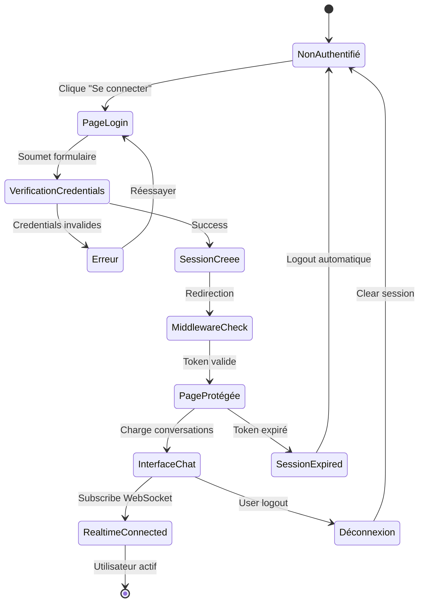

# Diagrammes Mermaid pour B2BChat

Ce fichier contient les diagrammes Mermaid à intégrer dans Notion.

---

## 1. Schéma d'architecture (Front, Back, DB, Intégrations)

### Code Mermaid

### Version alternative (Architecture en couches)

---

## 2. Diagramme UML de Classes (Données & Relations)

### Code Mermaid

### Version alternative (avec détails RLS et fonctions)

---

## 3. Diagramme de séquence : Envoi de message

---

## 4. Flux d'authentification

---

## 5. Architecture de déploiement

```mermaid
graph LR
    subgraph Development["💻 Développement"]
        Dev[Developer]
        Local[Local Environment<br/>npm run dev]
    end

    subgraph Version_Control["📦 Version Control"]
        Git[Git Local]
        GitHub[GitHub Repository]
    end

    subgraph CI["✅ CI Pipeline"]
        Actions[GitHub Actions]
        Lint[ESLint]
        TypeCheck[TypeScript Check]
        Build[Build Test]
    end

    subgraph CD["🚀 CD Pipeline"]
        Vercel[Vercel Platform]
        Preview[Preview Deploy]
        Prod[Production Deploy]
    end

    subgraph Backend["⚡ Backend"]
        Supabase[Supabase Cloud]
        DB[(PostgreSQL)]
        RT[Realtime]
    end

    Dev --> Local
    Local --> Git
    Git --> GitHub
    GitHub --> Actions
    Actions --> Lint
    Lint --> TypeCheck
    TypeCheck --> Build
    Build --> Vercel
    Vercel --> Preview
    Preview --> Prod
    Prod --> Supabase
    Supabase --> DB
    Supabase --> RT

    style Development fill:#dbeafe
    style Version_Control fill:#fef3c7
    style CI fill:#bbf7d0
    style CD fill:#ddd6fe
    style Backend fill:#fecaca
```

---

## Comment utiliser ces diagrammes dans Notion

### Méthode 1 : Bloc Mermaid natif (si supporté)
1. Dans Notion, tapez `/mermaid`
2. Collez le code Mermaid
3. Le diagramme s'affichera automatiquement

### Méthode 2 : Générer une image
1. Allez sur [mermaid.live](https://mermaid.live)
2. Collez le code Mermaid
3. Téléchargez l'image générée (PNG/SVG)
4. Uploadez l'image dans Notion

### Méthode 3 : Intégration avec GitHub
1. Créez un fichier `.md` dans votre repo avec les diagrammes
2. GitHub affichera automatiquement les diagrammes Mermaid
3. Créez un lien dans Notion vers ce fichier GitHub

---

## Légende des couleurs

- 🔵 **Bleu** : Frontend / Client
- 🟢 **Vert** : CI/CD / Hosting
- 🟣 **Violet** : Backend / Supabase
- 🔴 **Rouge** : Base de données
- 🟡 **Jaune** : Middleware / Sécurité
- 🟠 **Orange** : Relations / Pivot tables

